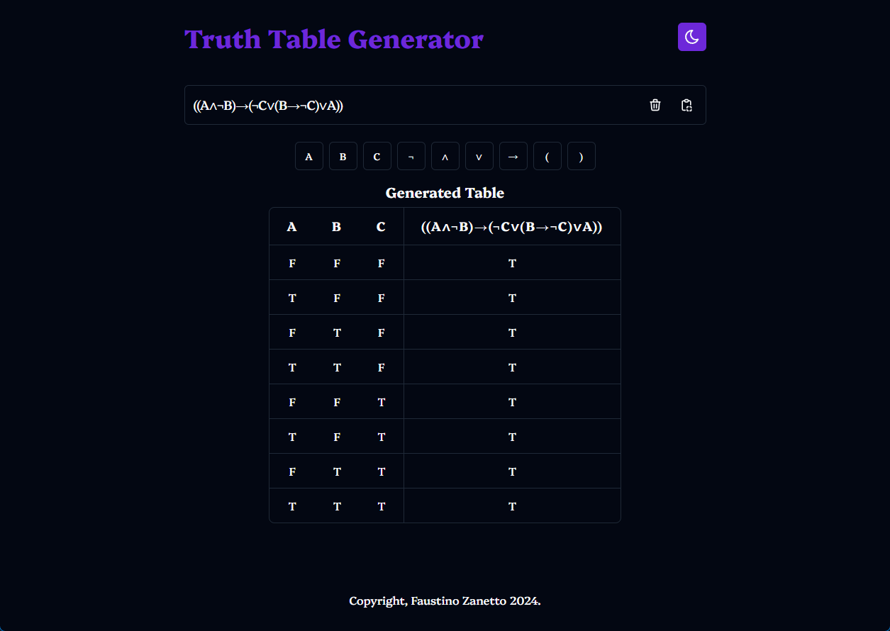

<h1 align="center">Truth Table Generator</h1>

<div align="center">
  
  <hr/>
  <p>
    <a href="https://twitter.com/faustinozanetto" target="_blank">
      
    </a>
  </p>
</div>

## ✨ About

Truth table generator is a simple and easy to use project for generating boolean logic tables by typing the expression.

## 🚀 Installation and Usage

```sh
git clone https://github.com/faustinozanetto/truth-table-generator # First clone the repo in your folder of choice.
cd /truth-table-generator # Move into the recently cloned repo.
pnpm install # Install using pnpm.
pnpm start # Boot up the project using the following command.
```

## 🛠️ Technologies

The project is being developed with the latest technlogoies used in the industry like:

- React
- Typescript
- TailwindCSS
- Husky
- ESLint
- Prettier
- Commitlint
- And more :)

## 🎛️ Project Structure

The project is quite simple and follows a minimal structure:

- `src`: the main directory of the project where most of the code is at.
- `assets`: the assets folder contains various files such as logos or imagae

## 👤 Author

**Faustino Zanetto**

- Website: [@faustinozanetto](https://faustinozanetto.vercel.app)
- Twitter: [@faustinozanetto](https://twitter.com/faustinozanetto)
- Github: [@faustinozanetto](https://github.com/faustinozanetto)
- LinkedIn: [@faustinozanetto](https://linkedin.com/in/faustino-zanetto-4294a3213)
